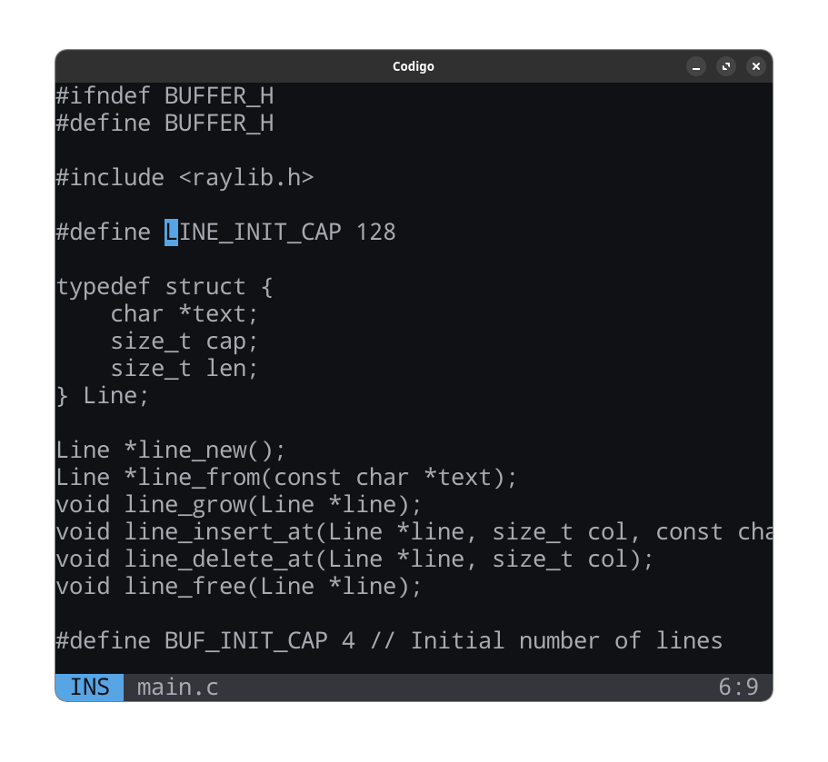

# Codigo

A text editor made with [Raylib](https://www.raylib.com).

<p align=center>
    
</p>

## Dependencies

- raylib (i'll probably include it on code in the future)
- make

## Setup

To build and run the application:

```console
$ make
```

Only build or only run the application:

```console
$ make build
$ make run
```
